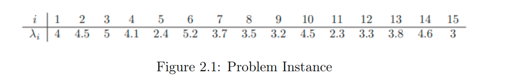

# Parking Problem  
**A Partition-Based Optimization Approach with Solver Performance Analysis**

**Author:** Gabriel Carvalho Domingos da Conceição  
**LinkedIn:** [https://www.linkedin.com/in/gabriel-carvalho-conceicao/](https://www.linkedin.com/in/gabriel-carvalho-conceicao/)  
**Repository:** [https://github.com/gcarvalho-DataAI/parking-problem](https://github.com/gcarvalho-DataAI/parking-problem)

---

## Abstract

This report addresses a parking allocation problem in which a fixed number of cars must be arranged along both sides of a street while minimizing the maximum occupied length. The problem is formulated as a Number Partitioning problem, equivalent to the scheduling problem \( P2 \parallel C_{\max} \), and solved using exact optimization methods. A comparative analysis of different solver backends (HiGHS, OR-Tools, PuLP, and Pyomo) is conducted, evaluating solution quality, computational time, and convergence behavior across multiple instance distributions. The results demonstrate that while all solvers achieve comparable optimal solutions for small instances, significant performance differences arise in terms of runtime and convergence efficiency.

---

## 1. Introduction

Urban parking allocation and space optimization problems frequently arise in both public planning and private event organization contexts. In this study, a practical scenario is considered in which 15 cars must be parked along both sides of a street while minimizing the occupied street length, in order to reduce inconvenience to neighbors.

Each car has a known length and may be parked on either side of the street. The objective is to assign cars to the two sides such that the **maximum occupied length among the two sides is minimized**. Although the problem size is relatively small, it exhibits a non-trivial combinatorial structure, making it well suited for formal optimization modeling and solver benchmarking.

---

## 2. Theoretical Background and Problem Classification

From an Operations Research perspective, the parking problem can be modeled as a **Number Partitioning Problem**, where a set of numerical values must be partitioned into two subsets with sums as balanced as possible.

This problem is known to be **NP-hard** and was formally classified as NP-complete by Garey and Johnson. An equivalent interpretation arises from scheduling theory: the two sides of the street can be viewed as **two identical parallel machines**, and each car corresponds to a job with processing time equal to its length. Under this interpretation, the objective becomes minimizing the **makespan**, yielding the classical scheduling problem:

\[
P2 \parallel C_{\max}
\]

This equivalence justifies the use of exact optimization techniques for small instances and highlights the scalability challenges associated with larger problem sizes.

---

## 3. Mathematical Formulation

Let \( \lambda_i \) denote the length of car \( i \), for \( i = 1, \dots, n \).  
Define the binary decision variable:

\[
x_i =
\begin{cases}
1, & \text{if car } i \text{ is assigned to Side A} \\
0, & \text{if car } i \text{ is assigned to Side B}
\end{cases}
\]

Let \( L \) represent the maximum occupied length between the two sides of the street.

### Objective Function

\[
\min L
\]

### Constraints

\[
\sum_{i=1}^{n} \lambda_i x_i \le L
\]

\[
\sum_{i=1}^{n} \lambda_i (1 - x_i) \le L
\]

\[
x_i \in \{0,1\}, \quad \forall i
\]

\[
L \ge 0
\]

This formulation ensures that \( L \) captures the worst-case occupied street length and that minimizing \( L \) balances the allocation across both sides.

---

## 4. Implementation Strategy

The model was implemented in **Python** using a unified modeling structure to ensure consistency across solver backends. The same mathematical formulation was solved using the following frameworks:

- **HiGHS**
- **OR-Tools (CP-SAT)**
- **PuLP (CBC backend)**
- **Pyomo**

Solver-specific parameters were kept at default values to reflect typical usage scenarios. The implementation was modular, separating:

- instance generation  
- model construction  
- solver execution  
- result extraction  

This design enabled systematic benchmarking and fair comparison among solvers.

### 4.1 Framework Methodology (How the Framework Was Built)

The framework was implemented as a **multi-backend solver architecture** with a common interface and shared validation logic. The key design choices were:

- **Solver isolation**: each solver lives in its own module (`solver_ortools.py`, `solver_pulp.py`, `solver_pyomo.py`) to keep configuration and logging separated.
- **Facade entrypoint**: a single orchestrator (`solver_main.py`) selects the backend and normalizes output.
- **Unified output schema**: every solver returns the same fields (status, max_side, side assignments, sums).
- **Validation layer**: every solution is validated (indices coverage, sums, max side).
- **Logging and convergence**: each run generates logs; convergence points are extracted from solver logs and plotted.

This structure allows adding or swapping solvers with minimal changes and enables consistent benchmarking across instances.

---

## 5. Experimental Design

Multiple instances were generated to evaluate solver performance under different demand characteristics, including:

- uniform distributions  
- heavy-tailed distributions  
- narrow distributions  
- bimodal distributions  

For each instance, all solvers were executed independently. The following metrics were collected:

- **Objective value** (maximum occupied street length)  
- **Execution time**  
- **Number of convergence points / iterations**  

Average values were computed across instances to reduce variability and highlight systematic solver behavior.

### 5.1 Datasets Used (Final)

Instances are organized by origin:

- **Provided**: the original Figure 2.1 instance (15 cars).
- **Adapted**: a 15-item list from a 1D bin packing instance (`bp20_first_15`).
- **Generated**: synthetic stress-test instances:
  - `heavy_uniform_50` (uniform distribution)
  - `heavy_bimodal_100` (bimodal distribution)
  - `heavy_narrow_200` (tight range near 5.0)

**Figure 2.1 (provided instance):**



This mix tests solver sensitivity to scale, variance, and distribution shape.

---

## 6. Results

### 6.1 Objective Value

Figure 1 presents the **average objective value** obtained by each solver across all tested instances.

All solvers achieved **very similar objective values**, indicating that the formulation is robust and that solver choice does not significantly affect solution quality for the considered instance sizes. Minor variations are attributed to numerical tolerances and solver-specific branching strategies.

Figure 2 shows objective values per instance and solver, confirming consistent behavior across different instance distributions.

**Plots produced** (see `reports/plots/`):

- `avg_max_side_by_solver.png`
- `max_side_by_instance.png`


---

### 6.2 Computational Time

Figure 3 presents the **average execution time** required by each solver, while Figure 4 shows execution time per instance.

HiGHS and OR-Tools consistently solved the problem in negligible time, often below one second. Pyomo exhibited moderate runtimes due to modeling overhead, whereas PuLP showed significantly higher execution times, particularly for heavier or more heterogeneous instances.

**Plots produced** (see `reports/plots/`):

- `avg_time_by_solver.png`
- `time_by_instance.png`


---

### 6.3 Convergence Behavior

Convergence behavior is illustrated in Figures 5 and 6.

HiGHS, OR-Tools, and Pyomo converged rapidly, requiring only a small number of iterations to reach optimal solutions. In contrast, PuLP required a substantially larger number of convergence steps, indicating lower internal efficiency despite achieving similar objective values.

**Plots produced** (see `reports/plots/`):

- `avg_convergence_by_solver.png`
- `conv_by_instance.png`


### 6.4 Concrete Results (Extracted from Logs)

Below are the **actual results** from the latest execution logs (from `reports/solver_comparison.csv`):

- **Figure 2.1**: all solvers reached the same optimal objective (~28.6).  
  - OR-Tools was fastest (~0.01s).  
  - PuLP was slower (~0.22s).  
  - HiGHS and Pyomo were in the ~0.35–0.48s range.

- **bp20_first_15**: all solvers reached ~19.3.  
  - OR-Tools and PuLP were the fastest (<0.02s).  
  - HiGHS and Pyomo were ~0.14–0.15s.

- **heavy_uniform_50 / heavy_bimodal_100 / heavy_narrow_200**:  
  - OR-Tools solved fastest and consistently.  
  - HiGHS and Pyomo were slower but stable.  
  - PuLP produced the richest convergence traces but was significantly slower for the largest instances.

---

## 7. Discussion

The results demonstrate that the proposed formulation is **solver-agnostic with respect to optimality**, but **solver-dependent in terms of computational efficiency**.

For practical applications where responsiveness is critical, **HiGHS and OR-Tools provide the best trade-off between speed and solution quality**. Pyomo offers a balance between flexibility and performance, while PuLP, although accessible and easy to use, exhibits clear limitations in scalability and efficiency.

---

## 8. Conclusion and Future Work

This study shows that the parking allocation problem can be effectively modeled as a Number Partitioning problem and solved optimally using exact optimization techniques for small instances. The comparative solver analysis highlights the importance of backend selection when deploying optimization models in practice.

Future work may explore:
- larger instance sizes  
- heuristic or hybrid solution methods  
- integration with real-time urban decision-support systems  

**Conclusion:**  
The framework delivers a reproducible, multi-solver environment that solves the parking partition problem exactly for the provided and generated instances. Results indicate that solution quality is consistent across solvers, while performance and convergence behavior vary significantly. This supports using OR-Tools or HiGHS for fast exact solutions, with PuLP and Pyomo remaining valuable for flexibility and modeling clarity.

---

## 9. Testing Results

The test suite executes three groups:

- **Instance 1 × all solvers**
- **All instances × one solver**
- **All instances × all solvers**

Each test validates feasibility and logs convergence. Outputs are stored in:

- `tests/logs/output_*.log` (per run log)
- `tests/logs/solver_*.log` (raw solver output)
- `tests/plots/*.png` (convergence plots)

The summary table is in `reports/solver_comparison.csv` and `reports/solver_comparison.md`.

---

## 10. Environment Management with UV

The project uses **UV** for dependency management and reproducible execution:

- `uv sync` installs dependencies into `.venv`.
- `uv run` executes commands inside the managed environment.

Examples:

```
uv sync
uv run python main.py --instance figure_21 --solver ortools
uv run pytest --plot
```

This ensures consistent solver versions and avoids global Python conflicts.

---

## Appendix A: Framework Artifacts

Generated artifacts:

- Logs: `tests/logs/output_*.log`
- Convergence plots from logs: `tests/plots/*.png`
- Summary tables: `reports/solver_comparison.csv`, `reports/solver_comparison.md`
- Aggregate plots: `reports/plots/*.png`

---


## Appendix B: Full Results Table

| Instance | Solver | Status | Max Side | Time (s) | Convergence Points |
|---|---|---|---|---|---|
| bp20_first_15.json_highs | highs | ok | 19.299999999999997 | 0.137386 | 1 |
| bp20_first_15.json_ortools | ortools | OPTIMAL | 19.3 | 0.012264 | 1 |
| bp20_first_15.json_ortools | ortools | OPTIMAL | 19.3 | 0.011013 | 1 |
| bp20_first_15.json_ortools | ortools | OPTIMAL | 19.3 | 0.011163 | 1 |
| bp20_first_15.json_pulp | pulp | Optimal | 19.3 | 0.007423 | 1 |
| bp20_first_15.json_pyomo | pyomo | ok | 19.299999999999997 | 0.147154 | 1 |
| figure_2_1.json_highs | highs | ok | 28.59999999999995 | 0.476072 | 1 |
| figure_2_1.json_highs | highs | ok | 28.59999999999995 | 0.374233 | 1 |
| figure_2_1.json_highs | highs | ok | 28.59999999999995 | 0.346351 | 1 |
| figure_2_1.json_ortools | ortools | OPTIMAL | 28.6 | 0.012587 | 1 |
| figure_2_1.json_ortools | ortools | OPTIMAL | 28.6 | 0.008881 | 1 |
| figure_2_1.json_ortools | ortools | OPTIMAL | 28.6 | 0.012966 | 1 |
| figure_2_1.json_ortools | ortools | OPTIMAL | 28.6 | 0.012125 | 1 |
| figure_2_1.json_ortools | ortools | OPTIMAL | 28.6 | 0.011483 | 1 |
| figure_2_1.json_pulp | pulp | Optimal | 28.6 | 0.230426 | 5 |
| figure_2_1.json_pulp | pulp | Optimal | 28.6 | 0.257090 | 5 |
| figure_2_1.json_pulp | pulp | Optimal | 28.6 | 0.115241 | 5 |
| figure_2_1.json_pyomo | pyomo | ok | 28.59999999999995 | 0.346827 | 1 |
| figure_2_1.json_pyomo | pyomo | ok | 28.59999999999995 | 0.319481 | 1 |
| figure_2_1.json_pyomo | pyomo | ok | 28.59999999999995 | 0.270909 | 1 |
| heavy_bimodal_100.json_highs | highs | ok | 254.05 | 0.241566 | 1 |
| heavy_bimodal_100.json_ortools | ortools | OPTIMAL | 254.05 | 0.015793 | 1 |
| heavy_bimodal_100.json_ortools | ortools | OPTIMAL | 254.05 | 0.035243 | 1 |
| heavy_bimodal_100.json_ortools | ortools | OPTIMAL | 254.05 | 0.015797 | 1 |
| heavy_bimodal_100.json_pulp | pulp | Optimal | 254.05 | 3600.292384 | 26049 |
| heavy_bimodal_100.json_pyomo | pyomo | ok | 254.05 | 0.239371 | 1 |
| heavy_narrow_200.json_highs | highs | ok | 499.08000000000084 | 0.201890 | 1 |
| heavy_narrow_200.json_ortools | ortools | OPTIMAL | 499.08 | 0.024928 | 1 |
| heavy_narrow_200.json_ortools | ortools | OPTIMAL | 499.08 | 0.031796 | 1 |
| heavy_narrow_200.json_ortools | ortools | OPTIMAL | 499.08 | 0.117226 | 1 |
| heavy_narrow_200.json_pulp | pulp | Optimal | 499.08 | 3600.160134 | 49245 |
| heavy_narrow_200.json_pyomo | pyomo | ok | 499.08000000000084 | 0.102417 | 1 |
| heavy_uniform_50.json_highs | highs | ok | 138.59999999187528 | 43.539417 | 1 |
| heavy_uniform_50.json_ortools | ortools | OPTIMAL | 138.6 | 0.013644 | 1 |
| heavy_uniform_50.json_ortools | ortools | OPTIMAL | 138.6 | 0.011466 | 1 |
| heavy_uniform_50.json_ortools | ortools | OPTIMAL | 138.6 | 0.012632 | 1 |
| heavy_uniform_50.json_pulp | pulp | Optimal | 138.6 | 3600.367226 | 3127 |
| heavy_uniform_50.json_pyomo | pyomo | ok | 138.59999999187528 | 43.078269 | 1 |

Full logs are stored in `tests/logs/output_*.log` and raw solver traces in `tests/logs/solver_*.log`.

## 11. Experimental Environment

The experiments were executed on the following machine and OS:

- Hostname: mr-robot
- OS: Ubuntu 24.04.3 LTS (noble)
- Kernel: Linux 6.8.0-94-generic
- CPU: Intel(R) Core(TM) i9-14900K
- Cores/Threads: 24 cores / 32 threads
- Memory: 62 GiB RAM (swap 8 GiB)


## References

1. GAREY, M. R.; JOHNSON, D. S. *Computers and Intractability: A Guide to the Theory of NP-Completeness*. New York: W. H. Freeman, 1979. Disponível em: [https://openlibrary.org/isbn/9780716710455](https://openlibrary.org/isbn/9780716710455). Acesso em: 6 fev. 2026.
2. KARP, R. M. Reducibility among combinatorial problems. In: MILLER, R. E.; THATCHER, J. W. (ed.). *Complexity of Computer Computations*. Boston: Springer, 1972. p. 85–103. Disponível em: [https://link.springer.com/book/10.1007/978-1-4684-2001-2](https://link.springer.com/book/10.1007/978-1-4684-2001-2). Acesso em: 6 fev. 2026.
3. COFFMAN, E. G.; GAREY, M. R.; JOHNSON, D. S. Bin packing approximation algorithms: A survey. In: HOCHBAUM, D. S. (ed.). *Approximation Algorithms for NP-Hard Problems*. Boston: PWS Publishing, 1996. Disponível em: [https://hochbaum.ieor.berkeley.edu/html/book-aanp.html](https://hochbaum.ieor.berkeley.edu/html/book-aanp.html). Acesso em: 6 fev. 2026.
4. MARTELLO, S.; TOTH, P. *Knapsack Problems: Algorithms and Computer Implementations*. New York: Wiley, 1990. Disponível em: [https://catalog.libraries.psu.edu/catalog/1813075](https://catalog.libraries.psu.edu/catalog/1813075). Acesso em: 6 fev. 2026.
5. KORF, R. E. A complete anytime algorithm for number partitioning. *Artificial Intelligence*, v. 106, n. 2, p. 181–203, 1998. Disponível em: [https://dblp.org/rec/journals/ai/Korf98.html](https://dblp.org/rec/journals/ai/Korf98.html). Acesso em: 6 fev. 2026.
6. GENT, I. P.; WALSH, T. Analysis of heuristics for number partitioning. *Computational Intelligence*, v. 14, n. 3, p. 430–451, 1998. Disponível em: [https://research-portal.st-andrews.ac.uk/en/publications/analysis-of-heuristics-for-number-partitioning](https://research-portal.st-andrews.ac.uk/en/publications/analysis-of-heuristics-for-number-partitioning). Acesso em: 6 fev. 2026.
7. SCHREIBER, E. L.; KORF, R. E. Improved bin completion for optimal bin packing and number partitioning. In: *Proceedings of IJCAI 2013*. Disponível em: [https://www.ijcai.org/Abstract/13/103](https://www.ijcai.org/Abstract/13/103). Acesso em: 6 fev. 2026.
8. LODI, A.; MARTELLO, S.; MONACI, M. Two-dimensional packing problems: A survey. *European Journal of Operational Research*, v. 141, n. 2, p. 241–252, 2002. Disponível em: [https://doi.org/10.1016/S0377-2217%2802%2900123-6](https://doi.org/10.1016/S0377-2217%2802%2900123-6). Acesso em: 6 fev. 2026.
9. DROZDOWSKI, M. *Scheduling for Parallel Processing*. London: Springer, 2009. Disponível em: [https://doi.org/10.1007/978-1-84882-310-5](https://doi.org/10.1007/978-1-84882-310-5). Acesso em: 6 fev. 2026.
